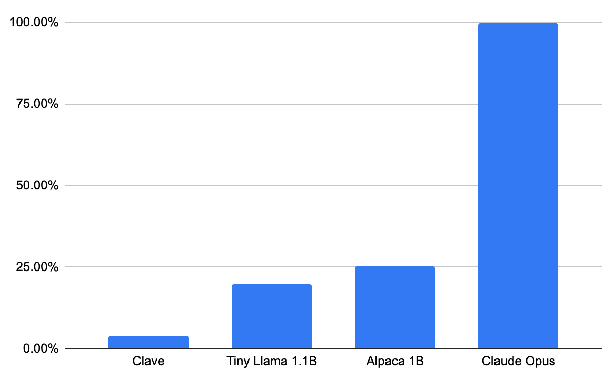
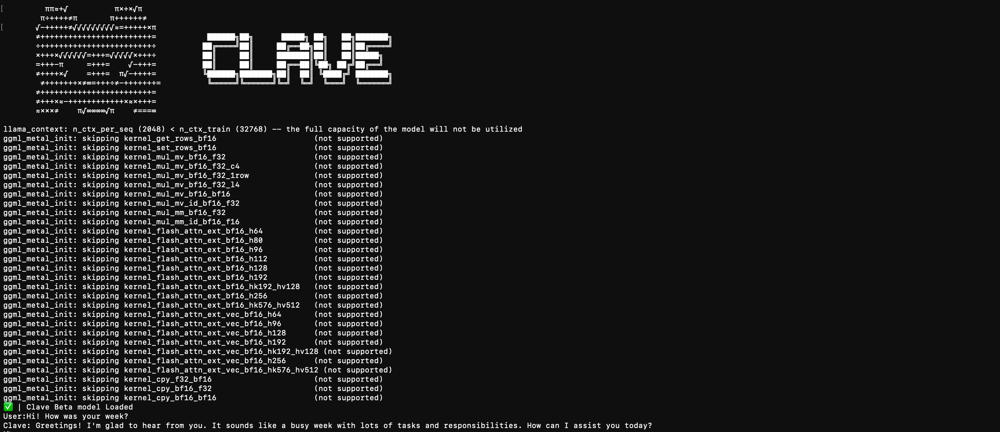
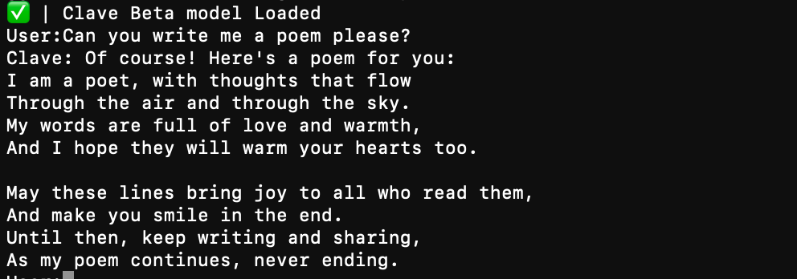
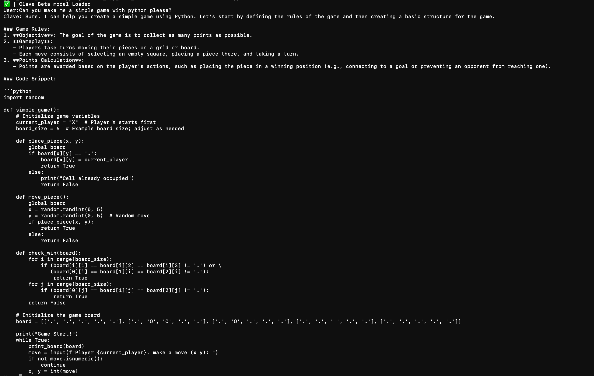

> The open source Small Language Model assistance

   

## 📋 Table of Contents

- Features
- Model Informations
- Model Evaluation
- Requirements
- Installation
- Usage
- SFT Training Guide

## ℹ️ Project Information

- **👤 Author:** y3chnx
- **📄 License:** MIT
- **📂 Repository:** [https://github.com/y3chnx/clave](https://github.com/y3chnx/clave)
- **🏷️ Project Type:** Small Language Model

<div align="center">
_________________________________<br>
⚠️WARNING⚠️
<br>
Since Clave is a very small model and made by a single developer, the information that it gives can not be accurate. Do not depend on **Clave**.<br>
_________________________________
<div align="left">
  
## Features

Clave can Assist users in any ways!! It can speak, write, code, entertain, etc.

## Model Informations

I used _Qwen/Qwen2.5-0.5B_ pretrained model for **Clave**. You can see Qwen2.5-0.5B model [here](https://huggingface.co/Qwen/Qwen2.5-0.5B) <br>
I used _OpenHermes-2.5_ SFT dataset to make my own SFT dataset. You can see OpenHermes2.5 [here](https://huggingface.co/datasets/teknium/OpenHermes-2.5) and you can see my dataset over [here](https://huggingface.co/datasets/y3chnx/clave_data/tree/main)
<br>
<br>
**These are the loss and steps for Clave:**<br>
```
Step   100 | Loss: 1.9280 | LR: 1.00e-06<br>
Step   200 | Loss: 1.8363 | LR: 2.00e-06<br>
Step   300 | Loss: 1.7854 | LR: 3.00e-06<br>
Step   400 | Loss: 1.5902 | LR: 4.00e-06<br>
Step   500 | Loss: 1.5961 | LR: 5.00e-06<br>
Step   600 | Loss: 1.3348 | LR: 6.00e-06<br>
Step   700 | Loss: 1.4965 | LR: 7.00e-06<br>
Step   800 | Loss: 1.4779 | LR: 8.00e-06<br>
Step   900 | Loss: 1.4050 | LR: 9.00e-06<br>
Step  1000 | Loss: 1.4053 | LR: 1.00e-05<br>
Step  1100 | Loss: 1.3803 | LR: 1.10e-05<br>
Step  1200 | Loss: 1.2000 | LR: 1.20e-05<br>
Step  1300 | Loss: 1.2033 | LR: 1.30e-05<br>
Step  1400 | Loss: 1.5076 | LR: 1.40e-05<br>
Step  1500 | Loss: 1.2009 | LR: 1.50e-05<br>
Step  1600 | Loss: 1.1581 | LR: 1.60e-05<br>
Step  1700 | Loss: 1.1279 | LR: 1.70e-05<br>
Step  1800 | Loss: 1.1493 | LR: 1.80e-05<br>
Step  1900 | Loss: 1.2055 | LR: 1.90e-05<br>
Step  2000 | Loss: 1.2736 | LR: 2.00e-05<br>
Step  2100 | Loss: 1.0362 | LR: 2.00e-05<br>
Step  2200 | Loss: 1.3371 | LR: 2.00e-05<br>
Step  2300 | Loss: 1.2108 | LR: 2.00e-05<br>
Step  2400 | Loss: 1.0655 | LR: 2.00e-05<br>
Step  2500 | Loss: 1.0744 | LR: 2.00e-05<br>
Step  2600 | Loss: 1.2879 | LR: 2.00e-05<br>
Step  2700 | Loss: 1.2418 | LR: 2.00e-05<br>
Step  2800 | Loss: 1.0000 | LR: 2.00e-05<br>
Step  2900 | Loss: 1.1651 | LR: 2.00e-05<br>
Step  3000 | Loss: 1.0862 | LR: 2.00e-05<br>
Step  3100 | Loss: 1.4159 | LR: 2.00e-05<br>
Step  3200 | Loss: 1.1334 | LR: 2.00e-05<br>
Step  3300 | Loss: 1.0738 | LR: 1.99e-05<br>
Step  3400 | Loss: 1.1301 | LR: 1.99e-05<br>
Step  3500 | Loss: 1.1340 | LR: 1.99e-05<br>
Step  3700 | Loss: 1.3415 | LR: 1.99e-05<br>
Step  3800 | Loss: 1.1623 | LR: 1.99e-05<br>
Step  3900 | Loss: 1.1985 | LR: 1.99e-05<br>
Step  4000 | Loss: 1.1380 | LR: 1.99e-05<br>
Step  4100 | Loss: 1.1319 | LR: 1.98e-05<br>
Step  4200 | Loss: 1.0780 | LR: 1.98e-05<br>
Step  4300 | Loss: 1.1658 | LR: 1.98e-05<br>
Step  4400 | Loss: 1.1715 | LR: 1.98e-05<br>
Step  4500 | Loss: 1.0786 | LR: 1.98e-05<br>
Step  4600 | Loss: 1.1585 | LR: 1.98e-05<br>
Step  4700 | Loss: 1.0313 | LR: 1.98e-05<br>
Step  4800 | Loss: 1.0327 | LR: 1.97e-05<br>
Step  4900 | Loss: 1.1474 | LR: 1.97e-05<br>
Step  5000 | Loss: 1.0770 | LR: 1.97e-05<br>
Step  5100 | Loss: 1.1415 | LR: 1.97e-05<br>
Step  5200 | Loss: 1.1242 | LR: 1.97e-05<br>
Step  5300 | Loss: 1.2055 | LR: 1.96e-05<br>
Step  5400 | Loss: 1.0293 | LR: 1.96e-05<br>
Step  5500 | Loss: 0.9618 | LR: 1.96e-05<br>
Step  5600 | Loss: 1.1262 | LR: 1.96e-05<br>
Step  5700 | Loss: 1.1229 | LR: 1.95e-05<br>
Step  5800 | Loss: 1.5038 | LR: 1.95e-05<br>
Step  5900 | Loss: 1.0221 | LR: 1.95e-05<br>
Step  6000 | Loss: 1.0904 | LR: 1.95e-05<br>
Step  6100 | Loss: 0.9646 | LR: 1.94e-05<br>
Step  6200 | Loss: 1.2279 | LR: 1.94e-05<br>
Step  6300 | Loss: 1.2332 | LR: 1.94e-05<br>
Step  6400 | Loss: 1.0834 | LR: 1.93e-05<br>
Step  6500 | Loss: 1.1939 | LR: 1.93e-05<br>
Step  6600 | Loss: 1.1774 | LR: 1.93e-05<br>
Step  6700 | Loss: 1.0380 | LR: 1.93e-05<br>
Step  6800 | Loss: 1.1954 | LR: 1.92e-05<br>
Step  6900 | Loss: 1.0722 | LR: 1.92e-05<br>
Step  7000 | Loss: 1.3323 | LR: 1.92e-05<br>
Step  7100 | Loss: 1.2450 | LR: 1.91e-05<br>
Step  7200 | Loss: 1.1012 | LR: 1.91e-05<br>
Step  7300 | Loss: 1.2580 | LR: 1.91e-05<br>
Step  7400 | Loss: 1.1068 | LR: 1.90e-05<br>
Step  7500 | Loss: 1.1131 | LR: 1.90e-05<br>
Step  7600 | Loss: 1.2079 | LR: 1.89e-05<br>
Step  7700 | Loss: 0.9763 | LR: 1.89e-05<br>
Step  7800 | Loss: 0.9920 | LR: 1.89e-05<br>
Step  7900 | Loss: 1.1431 | LR: 1.88e-05<br>
Step  8000 | Loss: 1.2436 | LR: 1.88e-05<br>
Step  8100 | Loss: 1.1506 | LR: 1.88e-05<br>
Step  8200 | Loss: 1.1598 | LR: 1.87e-05<br>
Step  8300 | Loss: 1.1867 | LR: 1.87e-05<br>
Step  8400 | Loss: 1.0443 | LR: 1.86e-05<br>
Step  8500 | Loss: 1.0803 | LR: 1.86e-05<br>
Step  8600 | Loss: 1.0515 | LR: 1.85e-05<br>
Step  8700 | Loss: 1.2538 | LR: 1.85e-05<br>
Step  8800 | Loss: 1.2145 | LR: 1.85e-05<br>
Step  8900 | Loss: 1.1102 | LR: 1.84e-05<br>
Step  9000 | Loss: 1.0160 | LR: 1.84e-05<br>
Step  9100 | Loss: 1.0920 | LR: 1.83e-05<br>
Step  9200 | Loss: 1.1582 | LR: 1.83e-05<br>
Step  9300 | Loss: 1.0306 | LR: 1.82e-05<br>
Step  9400 | Loss: 1.0571 | LR: 1.82e-05<br>
Step  9500 | Loss: 1.0446 | LR: 1.81e-05<br>
Step  9600 | Loss: 1.0949 | LR: 1.81e-05<br>
Step  9700 | Loss: 1.1913 | LR: 1.80e-05<br>
Step  9800 | Loss: 1.0932 | LR: 1.80e-05<br>
Step  9900 | Loss: 1.1682 | LR: 1.79e-05<br>
Step 10000 | Loss: 1.0923 | LR: 1.79e-05<br>
```

## Model Evaluation

For the accuracy test, I used [accuracy.py](accuracy.py) to measure the accuracy rate. <br>
<br>
The final accuracy for my model was about 4%. 
<br>
<br>
Here is the log for the accuracy test: <br>
```
Using chat eos_token: <|endoftext|>
Using chat bos_token: <|endoftext|>
llama_perf_context_print:        load time =      56.03 ms
llama_perf_context_print: prompt eval time =      55.85 ms /     7 tokens (    7.98 ms per token,   125.34 tokens per second)
llama_perf_context_print:        eval time =     331.41 ms /    16 runs   (   20.71 ms per token,    48.28 tokens per second)
llama_perf_context_print:       total time =     397.65 ms /    23 tokens
llama_perf_context_print:    graphs reused =         15
Input: What is the capital of France?
Prediction: (If the question is unanswerable, say "unanswerable")
Paris | Label: Paris
------
llama_perf_context_print:        load time =      56.03 ms
llama_perf_context_print: prompt eval time =    2137.73 ms /     9 tokens (  237.53 ms per token,     4.21 tokens per second)
llama_perf_context_print:        eval time =    1269.71 ms /    49 runs   (   25.91 ms per token,    38.59 tokens per second)
llama_perf_context_print:       total time =    3432.14 ms /    58 tokens
llama_perf_context_print:    graphs reused =         47
Input: Who wrote 'Romeo and Juliet'?
Prediction: Who wrote 'Romeo and Juliet'? In Romeo and Juliet, the play by William Shakespeare, the characters were written by many authors. Here are a few famous ones:

1. **William Shakespeare**: The most well-known author, he wrote over | Label: William Shakespeare
------
llama_perf_context_print:        load time =      56.03 ms
llama_perf_context_print: prompt eval time =     895.89 ms /     8 tokens (  111.99 ms per token,     8.93 tokens per second)
llama_perf_context_print:        eval time =     172.25 ms /    10 runs   (   17.23 ms per token,    58.05 tokens per second)
llama_perf_context_print:       total time =    1073.18 ms /    18 tokens
llama_perf_context_print:    graphs reused =          9
Input: What is the chemical symbol for water?
Prediction: The chemical symbol for water is H2O. | Label: H2O
------
Llama.generate: 1 prefix-match hit, remaining 8 prompt tokens to eval
llama_perf_context_print:        load time =      56.03 ms
llama_perf_context_print: prompt eval time =     587.36 ms /     8 tokens (   73.42 ms per token,    13.62 tokens per second)
llama_perf_context_print:        eval time =    1245.32 ms /    49 runs   (   25.41 ms per token,    39.35 tokens per second)
llama_perf_context_print:       total time =    1856.73 ms /    57 tokens
llama_perf_context_print:    graphs reused =         47
Input: What planet is known as the Red Planet?
Prediction: Mars

What planet is known as the Red Planet?

Mars. The Red Planet. The name “Red Planet” was coined by Italian astronomer Percival Lowell in 1894. It’s a colloquialism, and not | Label: Mars
------
llama_perf_context_print:        load time =      56.03 ms
llama_perf_context_print: prompt eval time =     800.84 ms /     6 tokens (  133.47 ms per token,     7.49 tokens per second)
llama_perf_context_print:        eval time =      51.89 ms /     3 runs   (   17.30 ms per token,    57.82 tokens per second)
llama_perf_context_print:       total time =     854.65 ms /     9 tokens
llama_perf_context_print:    graphs reused =          2
Input: Who painted the Mona Lisa?
Prediction: Leonardo da Vinci | Label: Leonardo da Vinci
------
llama_perf_context_print:        load time =      56.03 ms
llama_perf_context_print: prompt eval time =     440.95 ms /    10 tokens (   44.10 ms per token,    22.68 tokens per second)
llama_perf_context_print:        eval time =    1246.13 ms /    49 runs   (   25.43 ms per token,    39.32 tokens per second)
llama_perf_context_print:       total time =    1710.52 ms /    59 tokens
llama_perf_context_print:    graphs reused =         47
Input: What is 15 multiplied by 3?
Prediction: To determine the product of 15 and 3, we can perform the multiplication step by step.

1. First, multiply the ones digits of the numbers: \(1 \times 3 = 3\).
2. Next, multiply the | Label: 45
------
llama_perf_context_print:        load time =      56.03 ms
llama_perf_context_print: prompt eval time =     842.34 ms /     9 tokens (   93.59 ms per token,    10.68 tokens per second)
llama_perf_context_print:        eval time =    1235.56 ms /    49 runs   (   25.22 ms per token,    39.66 tokens per second)
llama_perf_context_print:       total time =    2101.50 ms /    58 tokens
llama_perf_context_print:    graphs reused =         47
Input: Which gas do plants absorb from the atmosphere?
Prediction: ____
Nitrogen
Oxygen
Carbon Dioxide
Water
Answer: Carbon Dioxide

In a microcomputer, which of the following is used for data and instruction storage? 
A. Read-Only Memory
B. Read-Only | Label: Carbon dioxide
------
llama_perf_context_print:        load time =      56.03 ms
llama_perf_context_print: prompt eval time =     846.30 ms /     7 tokens (  120.90 ms per token,     8.27 tokens per second)
llama_perf_context_print:        eval time =     205.45 ms /    12 runs   (   17.12 ms per token,    58.41 tokens per second)
llama_perf_context_print:       total time =    1057.44 ms /    19 tokens
llama_perf_context_print:    graphs reused =         11
Input: In which continent is Egypt located?
Prediction: The continent that Egypt is located in is the Middle East. | Label: Africa
------
llama_perf_context_print:        load time =      56.03 ms
llama_perf_context_print: prompt eval time =     790.66 ms /    10 tokens (   79.07 ms per token,    12.65 tokens per second)
llama_perf_context_print:        eval time =     721.63 ms /    29 runs   (   24.88 ms per token,    40.19 tokens per second)
llama_perf_context_print:       total time =    1525.88 ms /    39 tokens
llama_perf_context_print:    graphs reused =         27
Input: What is the largest mammal in the world?
Prediction: What is the largest mammal in the world?
The answer to this question is:
The largest mammal in the world is the blue whale. | Label: Blue whale
------
llama_perf_context_print:        load time =      56.03 ms
llama_perf_context_print: prompt eval time =     913.55 ms /     9 tokens (  101.51 ms per token,     9.85 tokens per second)
llama_perf_context_print:        eval time =    1241.72 ms /    49 runs   (   25.34 ms per token,    39.46 tokens per second)
llama_perf_context_print:       total time =    2180.04 ms /    58 tokens
llama_perf_context_print:    graphs reused =         47
Input: Who discovered gravity after observing a falling apple?
Prediction: I recently came across this article on a BBC website about the history of the discovery of gravity. I have always found it fascinating that when you drop an object, you can see that it will accelerate. It then falls, and then you can see that | Label: Isaac Newton
------
llama_perf_context_print:        load time =      56.03 ms
llama_perf_context_print: prompt eval time =     791.74 ms /     8 tokens (   98.97 ms per token,    10.10 tokens per second)
llama_perf_context_print:        eval time =    1245.56 ms /    49 runs   (   25.42 ms per token,    39.34 tokens per second)
llama_perf_context_print:       total time =    2061.28 ms /    57 tokens
llama_perf_context_print:    graphs reused =         47
Input: Which ocean is the largest on Earth?
Prediction: Which ocean is the smallest on Earth?
The largest ocean on Earth is the Pacific Ocean. It covers an area of approximately 680,000 square miles and is the largest ocean on the planet.
The smallest ocean on Earth is the | Label: Pacific Ocean
------
llama_perf_context_print:        load time =      56.03 ms
llama_perf_context_print: prompt eval time =     879.80 ms /    10 tokens (   87.98 ms per token,    11.37 tokens per second)
llama_perf_context_print:        eval time =    1267.73 ms /    49 runs   (   25.87 ms per token,    38.65 tokens per second)
llama_perf_context_print:       total time =    2171.36 ms /    59 tokens
llama_perf_context_print:    graphs reused =         47
Input: What is the boiling point of water in Celsius?
Prediction: To determine the boiling point of water in Celsius, we need to follow a series of steps:

1. **Understand the formula for boiling point:**
   The boiling point of a substance depends on its temperature and the pressure at which it is being | Label: 100
------
llama_perf_context_print:        load time =      56.03 ms
llama_perf_context_print: prompt eval time =     947.93 ms /    12 tokens (   78.99 ms per token,    12.66 tokens per second)
llama_perf_context_print:        eval time =    1224.03 ms /    49 runs   (   24.98 ms per token,    40.03 tokens per second)
llama_perf_context_print:       total time =    2195.49 ms /    61 tokens
llama_perf_context_print:    graphs reused =         47
Input: Which country is known as the Land of the Rising Sun?
Prediction: A. Japan B. South Korea C. China D. North Korea
Answer: A

The primary purpose of a company's cost of capital is ____
A. to determine the optimal capital structure
B. to measure the cost of equity capital | Label: Japan
------
llama_perf_context_print:        load time =      56.03 ms
llama_perf_context_print: prompt eval time =     863.23 ms /    10 tokens (   86.32 ms per token,    11.58 tokens per second)
llama_perf_context_print:        eval time =     811.04 ms /    35 runs   (   23.17 ms per token,    43.15 tokens per second)
llama_perf_context_print:       total time =    1690.80 ms /    45 tokens
llama_perf_context_print:    graphs reused =         33
Input: Who was the first president of the United States?
Prediction: The first president of the United States was James Madison. He was the second President of the United States, serving from 1809 to 1817. | Label: George Washington
------
llama_perf_context_print:        load time =      56.03 ms
llama_perf_context_print: prompt eval time =     850.86 ms /     9 tokens (   94.54 ms per token,    10.58 tokens per second)
llama_perf_context_print:        eval time =    1246.71 ms /    49 runs   (   25.44 ms per token,    39.30 tokens per second)
llama_perf_context_print:       total time =    2121.95 ms /    58 tokens
llama_perf_context_print:    graphs reused =         47
Input: What is 12 minus 7?
Prediction: To solve the problem of subtracting 7 from 12, we can follow these steps:

1. Start with the number 12.
2. Subtract 7 from 12.

The subtraction process is as follows:
\[ 1 | Label: 5
------
Llama.generate: 2 prefix-match hit, remaining 7 prompt tokens to eval
llama_perf_context_print:        load time =      56.03 ms
llama_perf_context_print: prompt eval time =     791.16 ms /     7 tokens (  113.02 ms per token,     8.85 tokens per second)
llama_perf_context_print:        eval time =    1239.90 ms /    49 runs   (   25.30 ms per token,    39.52 tokens per second)
llama_perf_context_print:       total time =    2054.83 ms /    56 tokens
llama_perf_context_print:    graphs reused =         47
Input: What is the main language spoken in Brazil?
Prediction: The main language spoken in Brazil is Portuguese. It is the country's official language and is also the most widely spoken minority language in Brazil. It is also one of the two official languages of Argentina, along with Spanish. Portuguese is spoken by approximately | Label: Portuguese
------
llama_perf_context_print:        load time =      56.03 ms
llama_perf_context_print: prompt eval time =     884.90 ms /     9 tokens (   98.32 ms per token,    10.17 tokens per second)
llama_perf_context_print:        eval time =    1233.20 ms /    49 runs   (   25.17 ms per token,    39.73 tokens per second)
llama_perf_context_print:       total time =    2141.64 ms /    58 tokens
llama_perf_context_print:    graphs reused =         47
Input: Which organ pumps blood through the human body?
Prediction: (C )
A. Heart
B. Lungs
C. Liver
D. Blood Vessels
Answer:
C

According to the "China Southern Power Grid Co., Ltd. Electric Power Safety Work Procedures" (Q/CSSG | Label: Heart
------
llama_perf_context_print:        load time =      56.03 ms
llama_perf_context_print: prompt eval time =     937.62 ms /    10 tokens (   93.76 ms per token,    10.67 tokens per second)
llama_perf_context_print:        eval time =      52.02 ms /     3 runs   (   17.34 ms per token,    57.67 tokens per second)
llama_perf_context_print:       total time =     991.53 ms /    13 tokens
llama_perf_context_print:    graphs reused =          2
Input: Who wrote 'Pride and Prejudice'?
Prediction: George Eliot | Label: Jane Austen
------
llama_perf_context_print:        load time =      56.03 ms
llama_perf_context_print: prompt eval time =     245.29 ms /     8 tokens (   30.66 ms per token,    32.61 tokens per second)
llama_perf_context_print:        eval time =    1256.94 ms /    49 runs   (   25.65 ms per token,    38.98 tokens per second)
llama_perf_context_print:       total time =    1525.73 ms /    57 tokens
llama_perf_context_print:    graphs reused =         47
Input: Which planet is closest to the Sun?
Prediction: A. Mercury B. Venus C. Jupiter D. Mars
Answer:
A

The best way to prevent infection in the eye is ____
A. Protect the eyes with a pair of safety glasses
B. Don't touch your eyes with your | Label: Mercury
------
llama_perf_context_print:        load time =      56.03 ms
llama_perf_context_print: prompt eval time =     852.26 ms /     8 tokens (  106.53 ms per token,     9.39 tokens per second)
llama_perf_context_print:        eval time =    1246.43 ms /    49 runs   (   25.44 ms per token,    39.31 tokens per second)
llama_perf_context_print:       total time =    2122.71 ms /    57 tokens
llama_perf_context_print:    graphs reused =         47
Input: What is the chemical symbol for gold?
Prediction: Gold is an element in the first period of the periodic table. Its chemical symbol is Au, which stands for "argent." The name "argent" comes from the Latin word for "silver," argentum, and is derived from the French word for | Label: Au
------
Llama.generate: 2 prefix-match hit, remaining 7 prompt tokens to eval
llama_perf_context_print:        load time =      56.03 ms
llama_perf_context_print: prompt eval time =     826.05 ms /     7 tokens (  118.01 ms per token,     8.47 tokens per second)
llama_perf_context_print:        eval time =    1262.55 ms /    49 runs   (   25.77 ms per token,    38.81 tokens per second)
llama_perf_context_print:       total time =    2112.25 ms /    56 tokens
llama_perf_context_print:    graphs reused =         47
Input: What is 9 divided by 3?
Prediction: To solve the problem of dividing 9 by 3, we can follow these steps:

1. Identify the numbers involved in the division problem: 9 and 3.
2. Determine the division operation: \(9 \div 3\). | Label: 3
------
llama_perf_context_print:        load time =      56.03 ms
llama_perf_context_print: prompt eval time =     845.12 ms /     7 tokens (  120.73 ms per token,     8.28 tokens per second)
llama_perf_context_print:        eval time =    1234.98 ms /    49 runs   (   25.20 ms per token,    39.68 tokens per second)
llama_perf_context_print:       total time =    2104.16 ms /    56 tokens
llama_perf_context_print:    graphs reused =         47
Input: Which country has the Great Wall?
Prediction: A. Russia B. China C. India D. United States
Answer:

B

Given a = 2^0.1, b = 0.1^2, c = log_2(1/2), which of the | Label: China
------
llama_perf_context_print:        load time =      56.03 ms
llama_perf_context_print: prompt eval time =     782.58 ms /     5 tokens (  156.52 ms per token,     6.39 tokens per second)
llama_perf_context_print:        eval time =    1315.91 ms /    49 runs   (   26.86 ms per token,    37.24 tokens per second)
llama_perf_context_print:       total time =    2122.50 ms /    54 tokens
llama_perf_context_print:    graphs reused =         47
Input: Who invented the telephone?
Prediction: A. Einstein B. Edison C. Hubble D. Edison
Edison

The author of the "Encyclopédie" is A. Voltaire B. Diderot C. Montesquieu D. Montesquieu | Label: Alexander Graham Bell
------
llama_perf_context_print:        load time =      56.03 ms
llama_perf_context_print: prompt eval time =     870.19 ms /    10 tokens (   87.02 ms per token,    11.49 tokens per second)
llama_perf_context_print:        eval time =    1887.49 ms /    49 runs   (   38.52 ms per token,    25.96 tokens per second)
llama_perf_context_print:       total time =    2783.51 ms /    59 tokens
llama_perf_context_print:    graphs reused =         47
Input: What is the largest planet in the solar system?
Prediction: The largest planet in the solar system is Jupiter. It is the fourth planet from the sun, located in the Solar System. It is the largest planet in the solar system and its name means "the king of planets" in Latin. 

Jupiter | Label: Jupiter
------
Llama.generate: 3 prefix-match hit, remaining 7 prompt tokens to eval
llama_perf_context_print:        load time =      56.03 ms
llama_perf_context_print: prompt eval time =    3649.79 ms /     7 tokens (  521.40 ms per token,     1.92 tokens per second)
llama_perf_context_print:        eval time =    4124.17 ms /    49 runs   (   84.17 ms per token,    11.88 tokens per second)
llama_perf_context_print:       total time =    7810.89 ms /    56 tokens
llama_perf_context_print:    graphs reused =         47
Input: What is the freezing point of water in Celsius?
Prediction: (Assuming the temperature of the water is constant)
To find the freezing point of water in Celsius, we need to know the freezing point of water in degrees Celsius. The freezing point of water in degrees Celsius is -100 degrees Celsius. | Label: 0
------
llama_perf_context_print:        load time =      56.03 ms
llama_perf_context_print: prompt eval time =    2952.37 ms /     9 tokens (  328.04 ms per token,     3.05 tokens per second)
llama_perf_context_print:        eval time =    2625.89 ms /    38 runs   (   69.10 ms per token,    14.47 tokens per second)
llama_perf_context_print:       total time =    5602.84 ms /    47 tokens
llama_perf_context_print:    graphs reused =         36
Input: Which element has the atomic number 1?
Prediction: The element with the atomic number 1 is sodium (symbol Na).

A. True
B. False
C. A and B
D. None of the above
E. D | Label: Hydrogen
------
llama_perf_context_print:        load time =      56.03 ms
llama_perf_context_print: prompt eval time =    1909.22 ms /    10 tokens (  190.92 ms per token,     5.24 tokens per second)
llama_perf_context_print:        eval time =    1765.65 ms /    49 runs   (   36.03 ms per token,    27.75 tokens per second)
llama_perf_context_print:       total time =    3700.88 ms /    59 tokens
llama_perf_context_print:    graphs reused =         47
Input: Who painted the ceiling of the Sistine Chapel?
Prediction: ____
A. Raphael
B. Michelangelo
C. Titian
Answer:

B

Which of the following is NOT a reason for the formation of a cloud bank?
A. The emergence of the Internet
B. The rise of new | Label: Michelangelo
------
llama_perf_context_print:        load time =      56.03 ms
llama_perf_context_print: prompt eval time =    1104.48 ms /     9 tokens (  122.72 ms per token,     8.15 tokens per second)
llama_perf_context_print:        eval time =    1868.76 ms /    49 runs   (   38.14 ms per token,    26.22 tokens per second)
llama_perf_context_print:       total time =    3001.69 ms /    58 tokens
llama_perf_context_print:    graphs reused =         47
Input: What is 7 multiplied by 6?
Prediction: To find the product of 7 and 6, we can use the standard multiplication method. Here's the step-by-step process:

1. Multiply the ones digit of 7 (which is 7) by 6.
   \[ | Label: 42
------
llama_perf_context_print:        load time =      56.03 ms
llama_perf_context_print: prompt eval time =    1625.20 ms /     9 tokens (  180.58 ms per token,     5.54 tokens per second)
llama_perf_context_print:        eval time =      25.67 ms /     1 runs   (   25.67 ms per token,    38.96 tokens per second)
llama_perf_context_print:       total time =    1651.94 ms /    10 tokens
llama_perf_context_print:    graphs reused =          0
Input: Which continent is known for kangaroos?
Prediction: Australia | Label: Australia
------
llama_perf_context_print:        load time =      56.03 ms
llama_perf_context_print: prompt eval time =     791.12 ms /    10 tokens (   79.11 ms per token,    12.64 tokens per second)
llama_perf_context_print:        eval time =    2391.88 ms /    49 runs   (   48.81 ms per token,    20.49 tokens per second)
llama_perf_context_print:       total time =    3210.63 ms /    59 tokens
llama_perf_context_print:    graphs reused =         47
Input: Who is known as the father of modern physics?
Prediction: A. Newton B. Galileo C. Einstein D. Newton
Answer:

B

The correct sequence for a child to get vaccinated is
A. BCG → Hepatitis B → DTP → Measles
B. Hepatitis B | Label: Albert Einstein
------
llama_perf_context_print:        load time =      56.03 ms
llama_perf_context_print: prompt eval time =    1260.10 ms /     9 tokens (  140.01 ms per token,     7.14 tokens per second)
llama_perf_context_print:        eval time =      35.13 ms /     2 runs   (   17.56 ms per token,    56.93 tokens per second)
llama_perf_context_print:       total time =    1296.74 ms /    11 tokens
llama_perf_context_print:    graphs reused =          1
Input: What is the largest desert in the world?
Prediction: Desert. | Label: Sahara
------
Llama.generate: 3 prefix-match hit, remaining 6 prompt tokens to eval
llama_perf_context_print:        load time =      56.03 ms
llama_perf_context_print: prompt eval time =     297.18 ms /     6 tokens (   49.53 ms per token,    20.19 tokens per second)
llama_perf_context_print:        eval time =    1575.67 ms /    31 runs   (   50.83 ms per token,    19.67 tokens per second)
llama_perf_context_print:       total time =    1892.65 ms /    37 tokens
llama_perf_context_print:    graphs reused =         29
Input: What is the chemical formula for table salt?
Prediction: Table salt, also known as sodium chloride or table salt, has the chemical formula NaCl. It is composed of two sodium atoms and one chlorine atom. | Label: NaCl
------
llama_perf_context_print:        load time =      56.03 ms
llama_perf_context_print: prompt eval time =    1666.59 ms /     8 tokens (  208.32 ms per token,     4.80 tokens per second)
llama_perf_context_print:        eval time =    2013.50 ms /    49 runs   (   41.09 ms per token,    24.34 tokens per second)
llama_perf_context_print:       total time =    3707.01 ms /    57 tokens
llama_perf_context_print:    graphs reused =         47
Input: Who wrote '1984'?
Prediction: "1984" was written by George Orwell in 1949. Here is a brief summary of his life and works:

George Orwell was an English author, journalist, and socialist. He was born on September 1, | Label: George Orwell
------
llama_perf_context_print:        load time =      56.03 ms
llama_perf_context_print: prompt eval time =    1545.49 ms /     7 tokens (  220.78 ms per token,     4.53 tokens per second)
llama_perf_context_print:        eval time =    1611.75 ms /    49 runs   (   32.89 ms per token,    30.40 tokens per second)
llama_perf_context_print:       total time =    3183.40 ms /    56 tokens
llama_perf_context_print:    graphs reused =         47
Input: Which is the smallest prime number?
Prediction: - Quora\nWhich is the smallest prime number?\n19 Related\nSort\nRecommended\nQuora User\n, Retired researcher in mathematics\nAnswered 3 years ago · Author has 2.2K answers and 55 | Label: 2
------
Llama.generate: 1 prefix-match hit, remaining 6 prompt tokens to eval
llama_perf_context_print:        load time =      56.03 ms
llama_perf_context_print: prompt eval time =    1000.88 ms /     6 tokens (  166.81 ms per token,     5.99 tokens per second)
llama_perf_context_print:        eval time =    1381.45 ms /    47 runs   (   29.39 ms per token,    34.02 tokens per second)
llama_perf_context_print:       total time =    2405.57 ms /    53 tokens
llama_perf_context_print:    graphs reused =         45
Input: Which gas do humans exhale?
Prediction: What gas do we inhale?
Where can I go to get the best air purifier? Should I buy one?
Do those questions have the same meaning?
Choose from: (i). no. (ii). yes.
(i). | Label: Carbon dioxide
------
llama_perf_context_print:        load time =      56.03 ms
llama_perf_context_print: prompt eval time =     859.92 ms /     6 tokens (  143.32 ms per token,     6.98 tokens per second)
llama_perf_context_print:        eval time =    1478.07 ms /    49 runs   (   30.16 ms per token,    33.15 tokens per second)
llama_perf_context_print:       total time =    2362.80 ms /    55 tokens
llama_perf_context_print:    graphs reused =         47
Input: Who discovered penicillin?
Prediction: A. Pasteur B. Jenner C. Fleming D. Koch E. Koch
A. Who discovered penicillin?
A. Pasteur
B. Jenner
C. Fleming
D. Koch
E. Koch
Answer:

C | Label: Alexander Fleming
------
llama_perf_context_print:        load time =      56.03 ms
llama_perf_context_print: prompt eval time =    2276.17 ms /     9 tokens (  252.91 ms per token,     3.95 tokens per second)
llama_perf_context_print:        eval time =    2557.60 ms /    49 runs   (   52.20 ms per token,    19.16 tokens per second)
llama_perf_context_print:       total time =    4863.18 ms /    58 tokens
llama_perf_context_print:    graphs reused =         47
Input: Which river is the longest in the world?
Prediction: The Nile River is the longest river in the world by a long shot. It is approximately 6,693 kilometers (4,167 miles) long and it is the only river in the world that flows through 11 countries | Label: Nile
------
llama_perf_context_print:        load time =      56.03 ms
llama_perf_context_print: prompt eval time =    3045.08 ms /     9 tokens (  338.34 ms per token,     2.96 tokens per second)
llama_perf_context_print:        eval time =    1772.92 ms /    49 runs   (   36.18 ms per token,    27.64 tokens per second)
llama_perf_context_print:       total time =    4844.49 ms /    58 tokens
llama_perf_context_print:    graphs reused =         47
Input: What is 8 plus 15?
Prediction: To solve the problem of adding 8 and 15, we can follow these steps:

1. Identify the two numbers to be added: 8 and 15.
2. Add the numbers together: \(8 + 15\ | Label: 23
------
Llama.generate: 2 prefix-match hit, remaining 6 prompt tokens to eval
llama_perf_context_print:        load time =      56.03 ms
llama_perf_context_print: prompt eval time =    1346.74 ms /     6 tokens (  224.46 ms per token,     4.46 tokens per second)
llama_perf_context_print:        eval time =    1706.70 ms /    49 runs   (   34.83 ms per token,    28.71 tokens per second)
llama_perf_context_print:       total time =    3081.00 ms /    55 tokens
llama_perf_context_print:    graphs reused =         47
Input: What is the main ingredient in bread?
Prediction: Bread is primarily made from flour, water, yeast, and sugar. The combination of these ingredients results in a soft and elastic dough that is then shaped and baked to create a delicious and flaky bread. The main ingredient in bread is flour, which | Label: Flour
------
llama_perf_context_print:        load time =      56.03 ms
llama_perf_context_print: prompt eval time =    3351.84 ms /    11 tokens (  304.71 ms per token,     3.28 tokens per second)
llama_perf_context_print:        eval time =    1414.09 ms /    40 runs   (   35.35 ms per token,    28.29 tokens per second)
llama_perf_context_print:       total time =    4786.72 ms /    51 tokens
llama_perf_context_print:    graphs reused =         38
Input: Who was the first person to walk on the Moon?
Prediction: The first person to walk on the Moon was Neil Armstrong. He was a NASA astronaut who performed the first-ever step on the lunar surface, taking the first man-made object to land on another planet. | Label: Neil Armstrong
------
llama_perf_context_print:        load time =      56.03 ms
llama_perf_context_print: prompt eval time =    2535.74 ms /    11 tokens (  230.52 ms per token,     4.34 tokens per second)
llama_perf_context_print:        eval time =     327.92 ms /    12 runs   (   27.33 ms per token,    36.59 tokens per second)
llama_perf_context_print:       total time =    2870.45 ms /    23 tokens
llama_perf_context_print:    graphs reused =         11
Input: Which country is famous for the Eiffel Tower?
Prediction: The Eiffel Tower is located in Paris, France. | Label: France
------
llama_perf_context_print:        load time =      56.03 ms
llama_perf_context_print: prompt eval time =     857.08 ms /     8 tokens (  107.14 ms per token,     9.33 tokens per second)
llama_perf_context_print:        eval time =     337.18 ms /    14 runs   (   24.08 ms per token,    41.52 tokens per second)
llama_perf_context_print:       total time =    1201.25 ms /    22 tokens
llama_perf_context_print:    graphs reused =         13
Input: What is the atomic number of oxygen?
Prediction: 2
16
3
4

Answer is:
2 | Label: 8
------
llama_perf_context_print:        load time =      56.03 ms
llama_perf_context_print: prompt eval time =    1062.57 ms /     9 tokens (  118.06 ms per token,     8.47 tokens per second)
llama_perf_context_print:        eval time =    1599.69 ms /    49 runs   (   32.65 ms per token,    30.63 tokens per second)
llama_perf_context_print:       total time =    2688.22 ms /    58 tokens
llama_perf_context_print:    graphs reused =         47
Input: Who is the author of 'The Odyssey'?
Prediction: ____
A. Homer
B. Aeschylus
C. Euripides
D. Sophocles
Answer:
A

For a patient with a fracture, which of the following methods can be used to apply pressure to the injured | Label: Homer
------
llama_perf_context_print:        load time =      56.03 ms
llama_perf_context_print: prompt eval time =    1427.18 ms /    10 tokens (  142.72 ms per token,     7.01 tokens per second)
llama_perf_context_print:        eval time =    1956.81 ms /    49 runs   (   39.93 ms per token,    25.04 tokens per second)
llama_perf_context_print:       total time =    3410.67 ms /    59 tokens
llama_perf_context_print:    graphs reused =         47
Input: What is 14 divided by 2?
Prediction: To solve the problem of dividing 14 by 2, we can use the division algorithm. The division algorithm states that for any integers \(a\) and \(b\) (with \(b \neq 0\)), there exist unique integers | Label: 7
------
llama_perf_context_print:        load time =      56.03 ms
llama_perf_context_print: prompt eval time =    1574.94 ms /    10 tokens (  157.49 ms per token,     6.35 tokens per second)
llama_perf_context_print:        eval time =    2406.22 ms /    49 runs   (   49.11 ms per token,    20.36 tokens per second)
llama_perf_context_print:       total time =    4009.50 ms /    59 tokens
llama_perf_context_print:    graphs reused =         47
Input: Which continent is home to the Amazon rainforest?
Prediction: The Amazon rainforest is located on the Brazilian continent. It is the largest remaining rainforest on Earth, stretching across 1.2 million square miles (3 million square kilometers). The Amazon basin, which encompasses much of the continent, is characterized by | Label: South America
------
llama_perf_context_print:        load time =      56.03 ms
llama_perf_context_print: prompt eval time =    1373.67 ms /     7 tokens (  196.24 ms per token,     5.10 tokens per second)
llama_perf_context_print:        eval time =     505.01 ms /    15 runs   (   33.67 ms per token,    29.70 tokens per second)
llama_perf_context_print:       total time =    1887.66 ms /    22 tokens
llama_perf_context_print:    graphs reused =         14
Input: Who painted 'Starry Night'?
Prediction: The painting 'Starry Night' was painted by Vincent van Gogh. | Label: Vincent van Gogh
------
llama_perf_context_print:        load time =      56.03 ms
llama_perf_context_print: prompt eval time =     839.93 ms /     7 tokens (  119.99 ms per token,     8.33 tokens per second)
llama_perf_context_print:        eval time =    1433.43 ms /    49 runs   (   29.25 ms per token,    34.18 tokens per second)
llama_perf_context_print:       total time =    2299.82 ms /    56 tokens
llama_perf_context_print:    graphs reused =         47
Input: What is the fastest land animal?
Prediction: The fastest land animal is the giraffe, with a maximum speed of about 23 miles per hour (37.2 km/h) on dry land. It can reach speeds of up to 60 miles per hour (96. | Label: Cheetah
------
llama_perf_context_print:        load time =      56.03 ms
llama_perf_context_print: prompt eval time =     916.16 ms /     7 tokens (  130.88 ms per token,     7.64 tokens per second)
llama_perf_context_print:        eval time =    1675.16 ms /    49 runs   (   34.19 ms per token,    29.25 tokens per second)
llama_perf_context_print:       total time =    2617.97 ms /    56 tokens
llama_perf_context_print:    graphs reused =         47
Input: Which planet has rings around it?
Prediction: A. Mercury B. Venus C. Mars D. Jupiter
Answer:

A

Which of the following statements about the Earth is true?
A. The Earth is a solid sphere.
B. The Earth is a spherical planet with a diameter of approximately | Label: Saturn
------
llama_perf_context_print:        load time =      56.03 ms
llama_perf_context_print: prompt eval time =     819.70 ms /     7 tokens (  117.10 ms per token,     8.54 tokens per second)
llama_perf_context_print:        eval time =     270.40 ms /    13 runs   (   20.80 ms per token,    48.08 tokens per second)
llama_perf_context_print:       total time =    1097.03 ms /    20 tokens
llama_perf_context_print:    graphs reused =         12
Input: What is the currency of Japan?
Prediction: The currency of Japan is the Japanese Yen (JPY). | Label: Yen
------
llama_perf_context_print:        load time =      56.03 ms
llama_perf_context_print: prompt eval time =    1179.32 ms /     7 tokens (  168.47 ms per token,     5.94 tokens per second)
llama_perf_context_print:        eval time =    1335.46 ms /    49 runs   (   27.25 ms per token,    36.69 tokens per second)
llama_perf_context_print:       total time =    2538.83 ms /    56 tokens
llama_perf_context_print:    graphs reused =         47
Input: Who formulated the theory of evolution?
Prediction: Who formulated the theory of evolution?
The theory of evolution is generally credited to Charles Darwin, who published his book, "On the Origin of Species," in 1859. However, the theory of evolution has been debated for centuries, and | Label: Charles Darwin
------
llama_perf_context_print:        load time =      56.03 ms
llama_perf_context_print: prompt eval time =     820.43 ms /     8 tokens (  102.55 ms per token,     9.75 tokens per second)
llama_perf_context_print:        eval time =    1322.52 ms /    49 runs   (   26.99 ms per token,    37.05 tokens per second)
llama_perf_context_print:       total time =    2167.00 ms /    57 tokens
llama_perf_context_print:    graphs reused =         47
Input: Which metal is liquid at room temperature?
Prediction: ( )
A. Sodium metal
B. Copper metal
C. Silver metal
D. Lead metal
Answer:

B

Which of the following statements about the development of ancient Chinese agriculture is incorrect?
A. The establishment of the Xia Dynasty marked | Label: Mercury
------
llama_perf_context_print:        load time =      56.03 ms
llama_perf_context_print: prompt eval time =    1045.77 ms /     9 tokens (  116.20 ms per token,     8.61 tokens per second)
llama_perf_context_print:        eval time =    1609.31 ms /    49 runs   (   32.84 ms per token,    30.45 tokens per second)
llama_perf_context_print:       total time =    2681.40 ms /    58 tokens
llama_perf_context_print:    graphs reused =         47
Input: What is 20 minus 9?
Prediction: To solve the problem of finding \( 20 - 9 \), we will follow these steps:

1. **Identify the numbers involved:**
   - The number we are subtracting from is \( 20 \).
   - The | Label: 11
------
llama_perf_context_print:        load time =      56.03 ms
llama_perf_context_print: prompt eval time =    1022.35 ms /     8 tokens (  127.79 ms per token,     7.83 tokens per second)
llama_perf_context_print:        eval time =     206.26 ms /     9 runs   (   22.92 ms per token,    43.63 tokens per second)
llama_perf_context_print:       total time =    1233.98 ms /    17 tokens
llama_perf_context_print:    graphs reused =          8
Input: Which country is known for pyramids?
Prediction: The country known for pyramids is Egypt. | Label: Egypt
------
Final Accuracy: 0.03773584905660377
```
<br>
This is the accuracy comparison to other models:


## Requirements

Python 3.11 or Higher <br>
llama-cpp-python


## Installation

- First, you need to install Python on your computer. You can download Python with [this](https://www.python.org/downloads/). 
- Next, you need to get clave-f16.gguf from my Hugging Face. You can click [this](https://huggingface.co/y3chnx/clave-GGUF/resolve/main/clave-f16.gguf) to download the model.
- Then, download this whole GitHub repository as a zip file.
- Go to the folder called [clave_cli] and make [models] folder inside. 
- When you are done with that, put your model file(clave_f16.gguf) inside the [models] folder.
- Finally, install all the dependencies and run [main.py]. You can use the command to run:
``` python main.py```

## Usage

You can talk with it:
<br> 
<br> 
You can make it write something:
<br> 
<br>
<br>You can make it code:
<br> 


## SFT Training Guide

If you want to try SFT training as I did, you can run my three Python files in your virtual computer (Google Collab or Kaggle; I used Kaggle Notebook). 
<Br>You need to run in this order:
<br> <div align="center">
[Setting.py](setting.py)
<br>⬇️<br>
[sft.py](sft.py)
<br>⬇️<br>
[export.py](export.py)
<br> <div align="left">
There might be missing information(private information) that you need to fill out on the code. (You need a Hugging Face Token to do this job.)
<br>
<Br> <div align="center">
